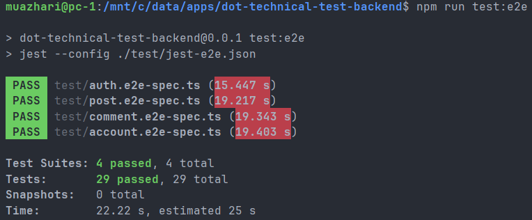

# Social Media Backend

A simple social media backend REST API built with NestJS and TypeORM following a pragmatic clean architecture structure. It provides JWT authentication (register/login), accounts, posts, and comments CRUD with role-based authorization (user/admin), PostgreSQL persistence, request-scoped transactions, Swagger docs, Docker Compose, and E2E tests.

## Why Clean Architecture Pattern

- Separation of concerns: controllers, services, and persistence.
- Testability: business logic isolated from frameworks and database specifics.
- Maintainability: clear boundaries and explicit dependencies.

In this repo we keep it pragmatic and lightweight:
- `modules/*` expose HTTP controllers and orchestrate services.
- `common/*` provides cross-cutting concerns (authentication, authorization, transaction).
- `infra/*` holds database entities.

## Features

- JWT auth (register, login)
- Accounts CRUD
- Posts CRUD
- Comments CRUD
- Role-based access control (admin can delete/update any post/comment, users only their own)
- Globally accessible per-request retryable safer transaction using AsyncLocalStorage and serializable isolation level
- Swagger docs at `/api`
- Docker Compose with PostgreSQL and automatic migrations
- E2E tests (Supertest + Jest)

## Getting Started (Local)

Prerequisites: Node.js, Docker, PostgreSQL.

1. Install deps

```cmd
npm install
```

2. Set an `.env` environment variable file. 

```
DATASTORE_1_HOST=localhost
DATASTORE_1_PORT=5432
DATASTORE_1_USER=postgres
DATASTORE_1_PASSWORD=postgres
DATASTORE_1_DATABASE=social_app
JWT_SECRET=dev_secret
PORT=3000
```

3. Start PostgreSQL quickly with Docker

```cmd
docker compose up -d datastore-1
```

4. Start the API in dev

```cmd
npm run start:dev
```

Open Swagger at http://localhost:3000/api

## E2E Tests

Make sure a test database is configured via env.

```cmd
npm run test:e2e
```

Latest test results:  


## API Overview

- Auths
  - POST `/auths/register` { email, password }
  - POST `/auths/login` { email, password } -> { access_token }
- Accounts (Bearer required)
  - GET `/accounts/me`
  - GET `/accounts` (admin)
  - PATCH `/accounts/:id`
  - DELETE `/accounts/:id`
- Posts (Bearer required)
  - GET `/posts`
  - POST `/posts` { content }
  - PATCH `/posts/:id` { content }
  - DELETE `/posts/:id`
- Comments (Bearer required)
  - GET `/posts/:postId/comments`
  - POST `/posts/:postId/comments` { content }
  - PATCH `/posts/:postId/comments/:id` { content }
  - DELETE `/posts/:postId/comments/:id`

## Notes

- Transactions: Each HTTP request runs in the highest transaction isolation level to be much safer in data consistency. A Unit of Work design pattern exposes the transaction-scoped repository.
- Migrations: Schema and seed are applied via `migration-1.sql` on `datastore-1` docker container startup.
- Security: Keep environment variables secure.

